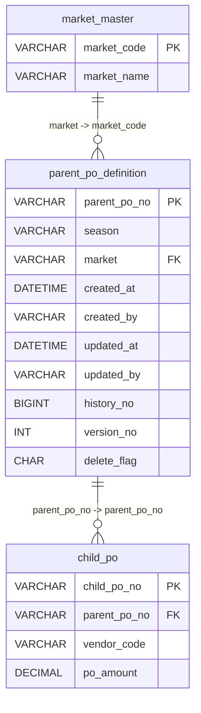

# Demo Merchandising Schema Documentation

This schema manages purchase order hierarchies, linking child purchase orders to parent definitions, while maintaining a master list of valid market codes.

## Schema Overview

- Database: `demo_merchandising`
- Tables documented: 3
- Relationships documented: 2

## ERD

## parent_po_definition

**Logical Name:** Parent Purchase Order Definition

Stores parent purchase order definitions used to group downstream purchase orders.

| No | Column Name (Physical) | Column Name (Logical) | Data Type | Length/Precision | PK | FK Reference | Not Null | Default | Description |
| --- | --- | --- | --- | --- | --- | --- | --- | --- | --- |
| 1 | parent_po_no | Parent PO Number | VARCHAR | 50 | Y |  | Y |  | Parent PO identifier. One parent PO can have multiple POs. |
| 2 | season | Season | VARCHAR | 20 | N |  | Y |  | Season of the PO (for example, HO25). |
| 3 | market | Market Code | VARCHAR | 200 | N | market_master.market_code | Y |  | Market code such as US, EMEA, or ROW. |
| 4 | created_at | Created Timestamp | DATETIME |  | N |  | Y | CURRENT_TIMESTAMP | Timestamp when the record was created. |
| 5 | created_by | Created By | VARCHAR | 50 | N |  | Y |  | User ID or process name that created the record. |
| 6 | updated_at | Updated Timestamp | DATETIME |  | N |  | Y | CURRENT_TIMESTAMP | Timestamp when the record was last updated. |
| 7 | updated_by | Updated By | VARCHAR | 50 | N |  | Y |  | User ID or process name that last updated the record. |
| 8 | history_no | History Number | BIGINT | 19 | N |  | Y |  | Surrogate key for the history record. |
| 9 | version_no | Version Number | INT | 10 | N |  | Y | 1 | Version sequence for the same parent PO record. |
| 10 | delete_flag | Delete Flag | CHAR | 1 | N |  | Y | 0 | Logical delete flag. '0' active, '1' deleted. |

## market_master

**Logical Name:** Market Master

Master table for valid market codes.

| No | Column Name (Physical) | Column Name (Logical) | Data Type | Length/Precision | PK | FK Reference | Not Null | Default | Description |
| --- | --- | --- | --- | --- | --- | --- | --- | --- | --- |
| 1 | market_code | Market Code | VARCHAR | 200 | Y |  | Y |  | Unique market code. |
| 2 | market_name | Market Name | VARCHAR | 200 | N |  | Y |  | Business-readable market name. |

## child_po

**Logical Name:** Child Purchase Order

Child purchase orders linked to a parent PO definition.

| No | Column Name (Physical) | Column Name (Logical) | Data Type | Length/Precision | PK | FK Reference | Not Null | Default | Description |
| --- | --- | --- | --- | --- | --- | --- | --- | --- | --- |
| 1 | child_po_no | Child PO Number | VARCHAR | 50 | Y |  | Y |  | Child PO identifier. |
| 2 | parent_po_no | Parent PO Number | VARCHAR | 50 | N | parent_po_definition.parent_po_no | Y |  | Parent PO linked to this child PO. |
| 3 | vendor_code | Vendor Code | VARCHAR | 50 | N |  | Y |  | Vendor code for the child PO. |
| 4 | po_amount | PO Amount | DECIMAL | 12,2 | N |  | Y | 0.00 | Total amount of the purchase order. |

## Notes / Open Questions

- The schema uses a soft-delete pattern via the 'delete_flag' column in the parent_po_definition table.
- The 'history_no' and 'version_no' columns in parent_po_definition suggest an audit or versioning tracking mechanism.
